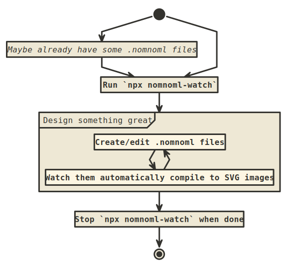

# nomnoml-watch


`npx` module to watch and automatically compile [`nomnoml`](http://www.nomnoml.com/) diagram files in the current directory.




## Description

`nomnoml` is a really cool tool to describe (UML) diagrams in a simple text format and then generate images from them for visual representation.

* Check out the online, client-side tool here: http://www.nomnoml.com/
* It is also open-source! https://github.com/skanaar/nomnoml
* And available as an `npm` module: https://www.npmjs.com/package/nomnoml

`nomnoml-watch` is a very simple program that watches `*.nomnoml` files in the current directory and automatically compiles them to SVG images on every change.


## Quick usage

* Have some `*.nomnoml` files in your current directory.
* Run `npx nomnoml-watch`!


## Command line arguments

```
Usage: nomnoml-watch [options]

Options:
  -V, --version              output the version number
  -1, --once                 run only once and then exit (default: false)
  -d, --import-depth <type>  maximum depth allowed when importing external files (default: 20)
  -h, --help                 display help for command
```


## TODO / Planned features

- [x] add CLI argument parsing
- [x] then add `--import-depth` argument
- [x] then add `--once` flag for one-off runs
- [ ] build dependency/import graph of files
- [ ] automatically re-compile files when imported files change


## Troubleshooting

If you encounter issues, watch the command line output while `nomnoml-watch` is running.

If you have import issues, you may have reached the import depth limit, resulting in an orange "end" visual, or the imported file is not found, resulting in a red "end" visual. Check the [`tests/`](tests/) folder for some examples.

Other rendering issues should be reported to the original nomnoml project here: https://github.com/skanaar/nomnoml/issues


## License

MIT
