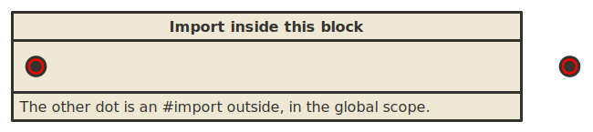
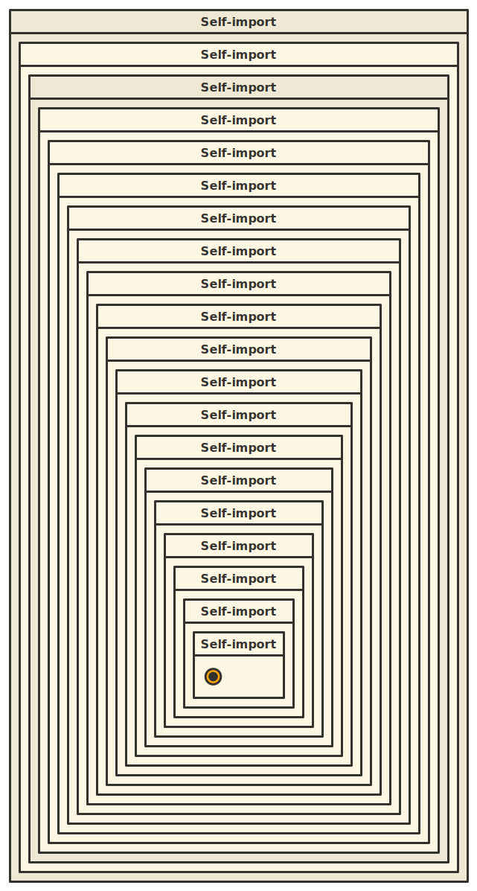
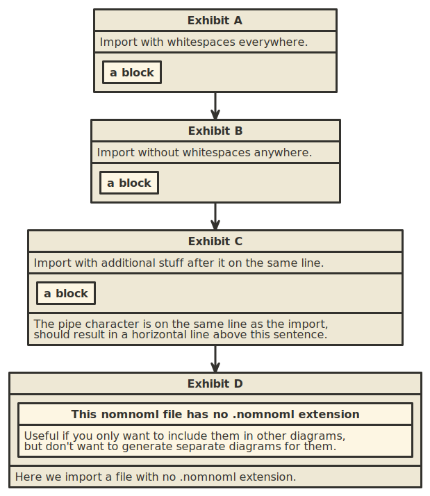

# Tests

These are not automated tests per se, rather just simple examples of using `nomnoml-watch` and making sure they produce the right output.

## [import_fail.nomnoml](import_fail.nomnoml)

This file tries to import a non-existing nomnoml file, which results in a red colored "end" visual element.

## [import_depth.nomnoml](import_depth.nomnoml)

This file imports itself until the import depth limit is reached, which results in an orange colored "end" visual element.

## [import_robustness.nomnoml](import_robustness.nomnoml)

This file imports the same file multiple times with different syntax, making sure the import directive is robust enough to handle every case. It also imports a file which has no `.nomnoml` extension.

